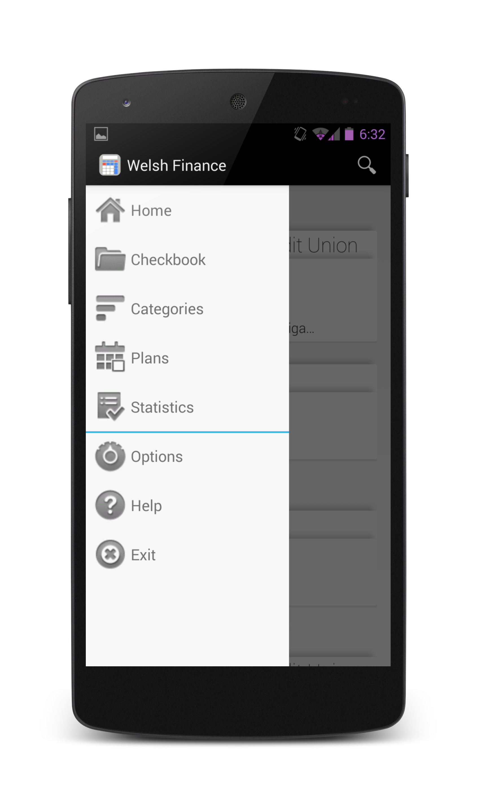
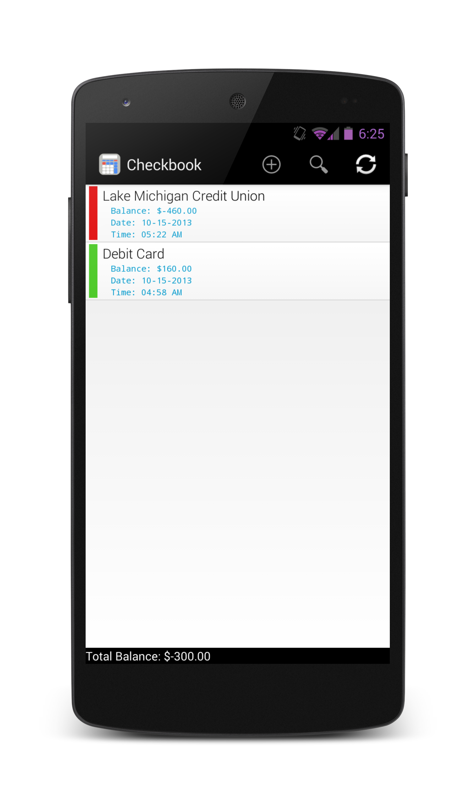
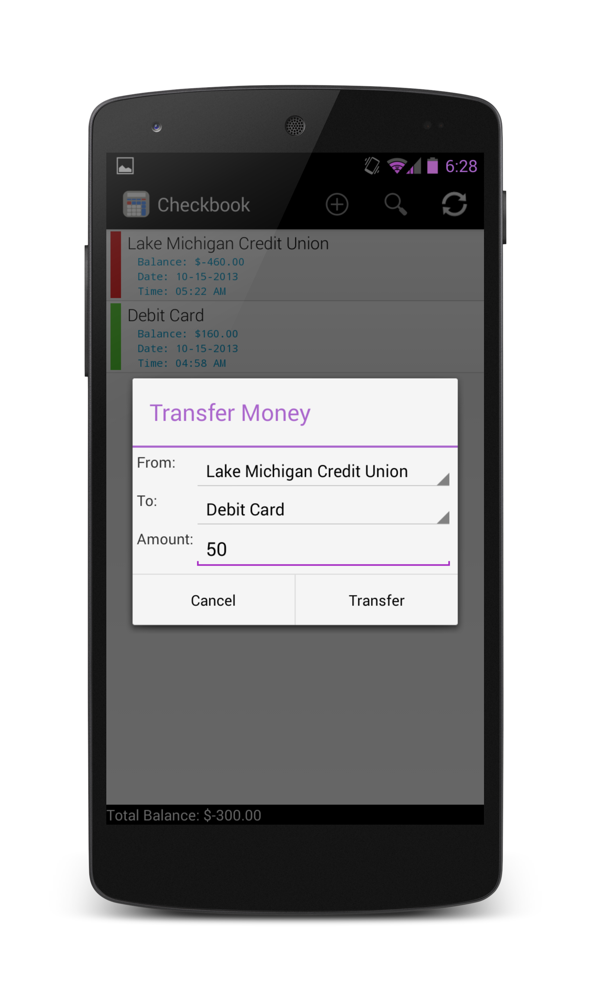
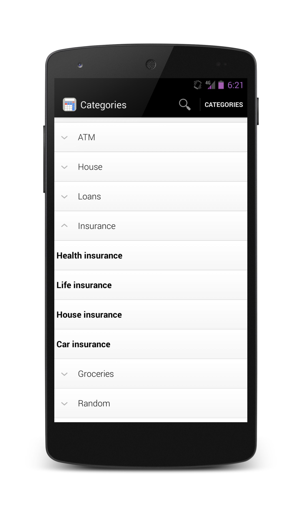
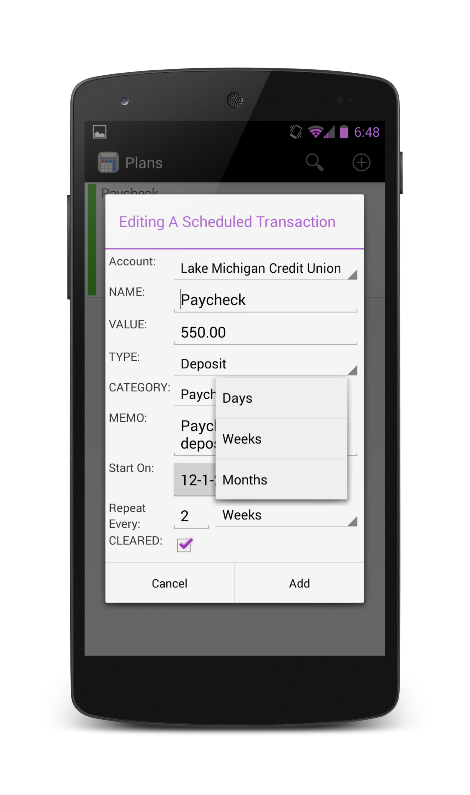
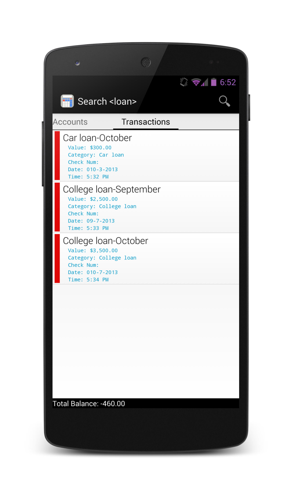
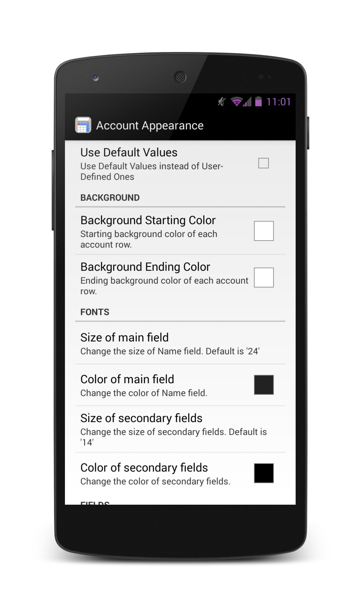
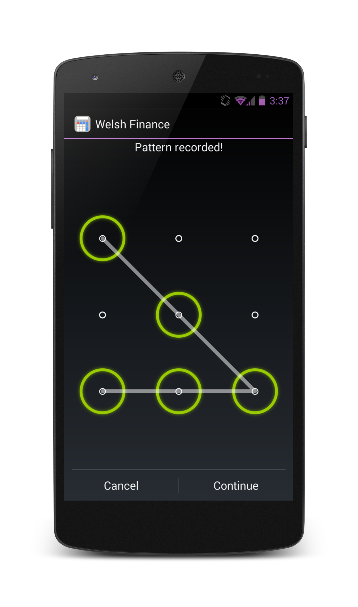

FinanceApp
================

A simple app to handle transactions on the go. Originally designed as a knockoff of ["Checkbook"](https://play.google.com/store/apps/details?id=com.tts.checkbookenhanced#?t=W251bGwsMSwxLDIxMiwiY29tLnR0cy5jaGVja2Jvb2tlbmhhbmNlZCJd) by Digital Life Solutions, it has since evolved to attempt to follow the Google Android Design Guidelines better (Holo Design, ActionBar, Fragments, ...). 

Screen Shots
--------------------------------------

Usage
--------------------------------------
There is currently no license I'm releasing this code under (subject to change). Feel free to use it in whatever way you see fit. 

Known Issues
--------------------------------------
* Options does not have the navigationDrawer yet
* Have a minor window leak in Options from delete dialog not being dismissed on rotation change (change to dialog fragment)

Things To Do
--------------------------------------
* Complete work on Dropbox sync and add Dropbox 'Saver' Drop-In (when it becomes available)
* Add Archieve support (ie keep balance when making back ups)
* Password/Pattern, warning of liability. Add encryption and email for recovery?
* CardsUI to display important information on homesceen
* Make the Attachment code available
* Add custom search suggestions
* PDF Reports
* Improve First-Time Run (use third party library to draw attention to objects, add default categories, wizard in the beginning for database syncing, ...)
* Export/Import oxf (Make sure to support required fields)
* Improve look (icons, default colors, slide menu, big notifications)
* Encrypt entire database (SQLCipher)

Optimizations
--------------------------------------
* Condense size (Clean up imports, delete useless variables,...)
* Fix Scopes (Global Variables,...) and code clean-up
* Optimize layouts for performance
* Cut Down on inflating views (costly operation)
* Make sure to use View Holder for ListView performance
* Let ContentProvider handle the cursors if possible
* Index Database Tables properly
* Make Virtual Tables for Searching
* Update third-party libraries and support library
* Use ASyncTask/threads for when you do heavy operations (don't do the operations on the UI)
* Make ListView only show a few entries, load new entries when needed (Endless listview)
* Make sure any SQL Joins are small (older sql_lite versions struggle with it)

Notes to Self
--------------------------------------
* Need more spinners, less typing
* What should happen when a user clicks on a search result?
* Possibly 'hide' advance options in add dialogs, 'expand' for more options
* Link a contact (own table?)
* Possibly a payee field, own table. Can avoid if description is dropdown.
* GIT Reminders for Myself:
	- git add -A
	- git commit -a -m 'Fixed some warnings'
	- git push -u origin master

Attachments
---------------------------------------
Supported
- Pictures
- Music (mp3,wav)
- Video (mpg,flv)
- Documents (doc,pptx,xls)

Attachments Not Working
- .mp4 files (found through the filemanager), can be returned. You can view them by hitting the filemanager in the selected programs which pops up another popup with video player in the list (Bug?). Selecting video player from that list makes it load the file, but the video stutters & audio not synced. This is due to lack of codec support on the platform.

- .avi files (found through the filemanager) can be returned. When you select the video player to view it, it only has audio. This is due to lack of codec support on the platform.

Third-Party Libraries Used
------------------------------------------
* [ActionBarSherlock](http://actionbarsherlock.com/) by Jake Wharton
* [Android Lock Pattern](https://code.google.com/p/android-lockpattern/)
* [ColorPickerPreference](https://github.com/attenzione/android-ColorPickerPreference) by Sergey Margaritov
* [Cards UI](https://github.com/nadavfima/cardsui-for-android) by nadavfima, [Cards UI fork](https://github.com/Androguide/cardsui-for-android) by Androguide
* Soon: [Showcase View](https://github.com/Espiandev/ShowcaseView) by Alex Curran
* Soon: [ChartView](https://github.com/nadavfima/ChartView/) by nadavfima
